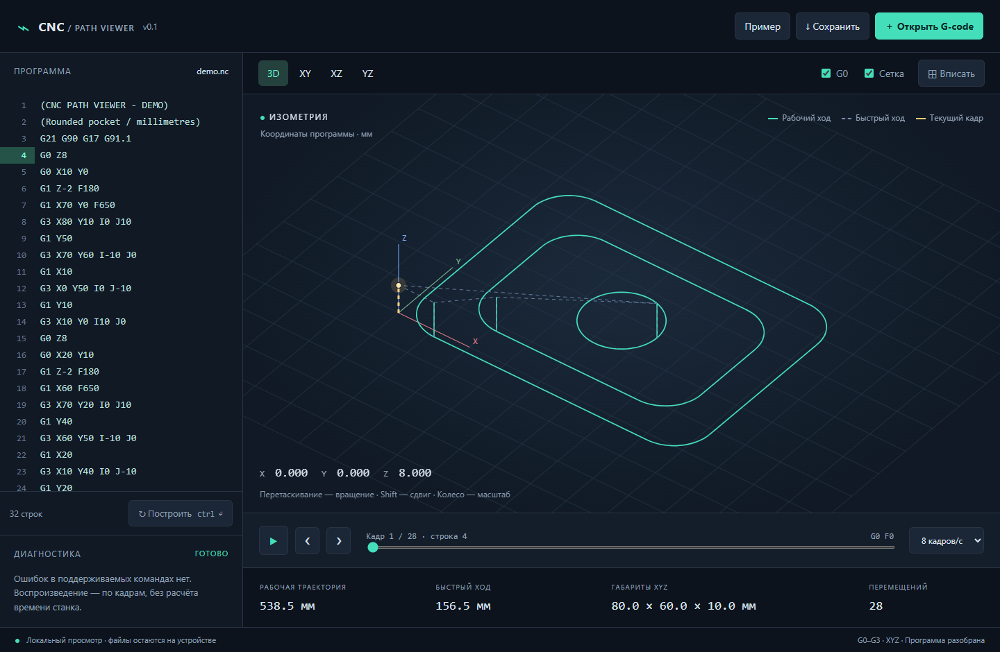

# ViewerGcode

Автономный просмотрщик G-code на JavaScript для CNC с возможностью интеграции в Windows через WebView2.

## Запуск

Откройте `cnc-viewer/index.html` в браузере или запустите локальный сервер (требуется Node.js):

```sh
cd cnc-viewer
npm start
```

Откройте http://127.0.0.1:4173. Внешние зависимости не требуются.

## Возможности

- Загрузка и редактирование G-code, UTF-8 / Windows-1251.
- Вращаемый 3D-вид и проекции XY/XZ/YZ.
- G0–G3, дуги IJK/R, модальные команды, мм/дюймы.
- Пошаговое воспроизведение: выполненные участки серые, оставшиеся рабочие ходы зелёные.
- Диагностика и опциональный пропуск блоков с неподдерживаемыми G/M-командами.
- JavaScript API и обмен сообщениями с WebView2.

Это просмотр программной траектории, без симуляции кинематики и столкновений станка. Подробные ограничения и API описаны в [документации](cnc-viewer/README.md).

## Проверка

```sh
cd cnc-viewer
npm test
```


